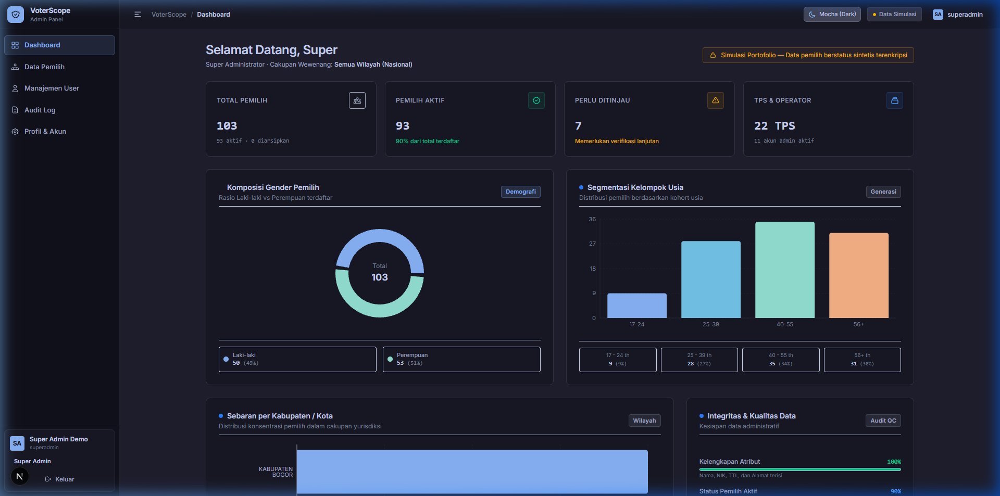
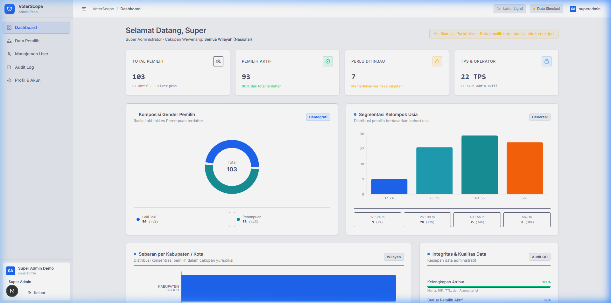
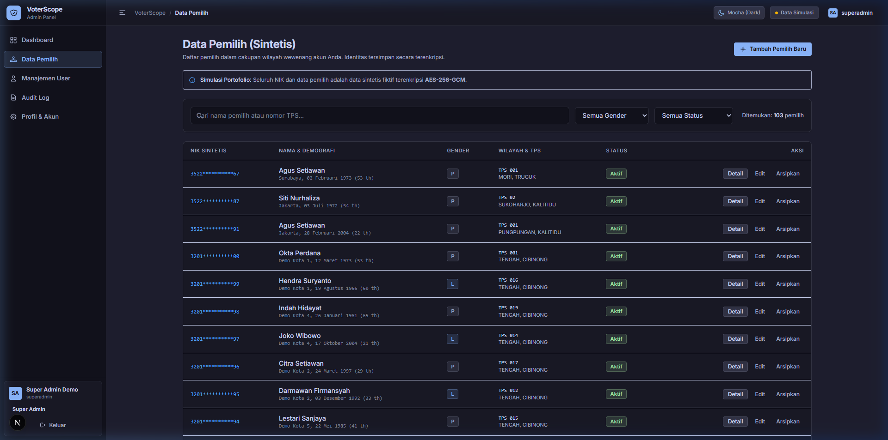
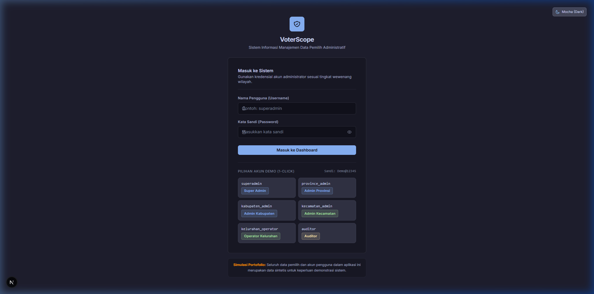

# VoterScope Demo

> **Compliance Notice**  
> This application is an educational and portfolio demonstration system using 100% synthetic, fabricated data. It is not designed or approved for processing real personal identity data. The application strictly functions as an administrative data management system and contains no political profiling, party preference classification, persuasion workflows, or electoral campaign targeting mechanisms.

---

## Overview

VoterScope Demo is a full-stack, local-first administrative voter data management application built with Next.js 16 (App Router), TypeScript, Prisma ORM, and SQLite.

The project demonstrates secure enterprise software architecture, multi-tier hierarchical authorization, cryptographic personal data protection, immutable compliance audit trails, and official administrative region integrations.

---

## Application Preview

VoterScope features an institutional, data-focused interface with native dual-theme support using the official Catppuccin palette.

### Dashboard & Demographic Analytics (Catppuccin Mocha — Dark Theme)


### Dashboard & Demographic Analytics (Catppuccin Latte — Light Theme)


### Voter Management Directory & Masked Dossier


### Authentication & Persona Selector


---

## Architectural Highlights & Key Features

### Hierarchical Role-Based Access Control (RBAC)
- Five-tier administrative hierarchy: `Nasional` (National), `Provinsi` (Province), `Kabupaten` (Regency/City), `Kecamatan` (District), and `Kelurahan` (Sub-district/Village).
- Server-authoritative boundary enforcement preventing horizontal and vertical privilege escalation (Anti-IDOR).
- Scoped delegation rules: Administrators can only manage users within or strictly below their geographic jurisdiction.

### Cryptographic Privacy & Blind Indexing
- **AES-256-GCM Encryption**: Synthetic identity numbers (Nomor Induk Kependudukan / NIK) are encrypted at rest using unique 96-bit initialization vectors (IV) and 128-bit authentication tags.
- **HMAC-SHA256 Blind Indexing**: Generates deterministic lookup hashes allowing instant duplicate detection without decrypting or exposing plaintext NIKs.
- **Default Masking**: Identity numbers remain masked (`3201************`) across tables and dossiers. Decryption is performed just-in-time and logged to the audit trail.

### Official Indonesian Administrative Hierarchy
- Integrated with the official Indonesian region standard (`api-wilayah-indonesia`).
- Covers all 38 provinces, 514 regencies/cities, and districts.
- Implements a resilient multi-tier caching strategy with in-memory caching and preloaded local snapshots for uninterrupted offline execution.

### Security Architecture
- **Argon2id Password Hashing**: Password hashing conforming to OWASP recommendations (`m=65536, t=3, p=4`).
- **Encrypted Session Management**: Sealed, stateless HTTP-only cookies using `iron-session` (AES-256-GCM, 8-hour TTL).
- **Abuse Prevention**: Sliding-window rate limiting on sensitive authentication and user creation endpoints.
- **Defensive Headers**: Strict Content Security Policy (CSP), anti-clickjacking (`X-Frame-Options: DENY`), and MIME-sniffing protection.

### Compliance Audit Trail & Analytics
- **Structured Audit Logging**: Captures actor ID, IP address, user agent, action type, affected target, and timestamp for all critical operations.
- **Compliance Export**: Filtered audit logs can be exported directly to standard JSON and CSV formats.
- **Jurisdiction-Scoped Visualizations**: Real-time demographic charts (age cohorts, gender distribution) calculated dynamically for the active user's territory.

### Catppuccin Theme Engine
- Integrated Catppuccin color system featuring **Catppuccin Mocha** (dark theme) and **Catppuccin Latte** (light theme).
- Persistent theme selection via `localStorage` with zero flash of unstyled content (FOUC).
- Accessible theme toggles on both the login screen and the navigation bar.

---

## Technology Stack

| Layer | Technology | Description |
|---|---|---|
| **Framework** | Next.js 16.3.4 (App Router) | Full-stack framework with Turbopack compilation |
| **Frontend** | React 19, Vanilla CSS | Responsive layouts with Catppuccin design tokens |
| **Language** | TypeScript 5 (Strict Mode) | End-to-end type safety across client and server |
| **Database** | SQLite + Prisma ORM 6.8.2 | Local, zero-configuration embedded database |
| **Authentication** | `iron-session` 8.0.4 | Sealed, encrypted cookie session storage |
| **Password Security** | `argon2` 0.45.1 | Argon2id password hashing |
| **Cryptography** | Node.js `crypto` | AES-256-GCM authenticated encryption and HMAC-SHA256 blind indexing |
| **Visualizations** | Recharts 3 | Responsive SVG charts for demographic distributions |
| **Testing** | Vitest 3.2.7 & Playwright 1.62.1 | 142 unit and integration tests, multi-role E2E browser test suites |

---

## Getting Started

### Prerequisites
- Node.js: v20 LTS or higher
- npm: v10 or higher

### Installation

1. Clone the repository and navigate into the project root:
   ```bash
   git clone https://github.com/username/voterscope-demo.git
   cd voterscope-demo
   ```

2. Install dependencies:
   ```bash
   npm install
   ```

3. Initialize the database, apply migrations, and seed demo accounts:
   ```bash
   npm run db:reset
   ```

4. Start the development server:
   ```bash
   npm run dev
   ```

5. Open [http://localhost:3000](http://localhost:3000) in your browser.

---

## Preconfigured Demo Accounts

All demo accounts share the password: `Demo@12345`

| Username | Role | Administrative Scope | Typical Responsibilities |
|---|---|---|---|
| `superadmin` | `SUPER_ADMIN` | National (All Indonesia) | System administration, user management, national analytics |
| `province_admin` | `PROVINCE_ADMIN` | Province (Demo Provinsi) | Provincial oversight, regency admin management |
| `kabupaten_admin` | `KABUPATEN_ADMIN` | Regency (Demo Kabupaten) | District oversight, sub-district admin management |
| `kecamatan_admin` | `KECAMATAN_ADMIN` | District (Demo Kecamatan) | Sub-district coordination, village operator management |
| `kelurahan_operator` | `KELURAHAN_OPERATOR` | Village (Demo Kelurahan) | Voter registration, address editing, verification status |
| `auditor` | `AUDITOR` | National (Read-Only) | Compliance monitoring, audit log review, data export |

---

## Project Directory Structure

```
voterscope-demo/
├── app/                  # Next.js App Router pages and route handlers
│   ├── api/              # Backend API endpoints (auth, voters, audit, users)
│   ├── dashboard/        # Authenticated application views and navigation
│   ├── login/            # Authentication interface and persona selector
│   ├── globals.css       # Design tokens and Catppuccin theme variables
│   └── layout.tsx        # Root HTML layout and theme initialization
├── components/           # Reusable UI component library
│   ├── dashboard/        # Demographic charts, scorecard metrics, and KPI cards
│   ├── theme/            # Theme switcher component (Mocha / Latte)
│   └── voters/           # Data tables, territory selectors, filters, and forms
├── docs/                 # Architectural documentation and interface screenshots
│   └── screenshots/      # Application preview screenshots
├── lib/                  # Business logic, security primitives, and data layers
│   ├── analytics/        # Demographic aggregation routines
│   ├── audit/            # Immutable audit logging engine
│   ├── auth/             # Session configuration and middleware helpers
│   ├── authorization/    # Scope hierarchy, RBAC guards, and IDOR validation
│   ├── db/               # Prisma database client instance
│   ├── security/         # AES-256-GCM cipher, blind indexing, and rate limiters
│   └── territory/        # Indonesian territory API service and caching logic
├── prisma/               # Database schema definition, migrations, and seed scripts
├── public/               # Static assets and icons
├── scripts/              # Utility scripts for data preparation
└── tests/                # Automated verification suites
    ├── unit/             # Vitest unit and integration tests (142 tests across 9 suites)
    └── e2e/              # Playwright multi-role browser end-to-end tests
```

---

## Verification & Quality Gates

The codebase adheres to strict quality and security standards. Run the following commands to execute test suites and quality gates:

```bash
# Run unit and integration tests (142 tests across 9 suites)
npm run test

# Run ESLint code quality checks (0 errors, 0 warnings)
npm run lint

# Compile production build with Turbopack (23 routes)
npm run build

# Run Playwright end-to-end browser tests
npm run test:e2e
```

---

## Technical Documentation

In-depth technical specifications and architectural documentation are available in the repository:

| Document | Description |
|---|---|
| [FINAL_AUDIT.md](FINAL_AUDIT.md) | Master Engineering & Security Audit: Route matrix, cryptography, and sign-off |
| [docs/demo-guide.md](docs/demo-guide.md) | Step-by-Step Evaluator Guide: Scenarios, role-based workflows, and unmasking walkthroughs |
| [docs/testing.md](docs/testing.md) | Testing Strategy: Test coverage matrix, mock implementations, and quality gates |
| [docs/architecture.md](docs/architecture.md) | System Architecture: Request lifecycle, boundaries, and data flow |
| [docs/security.md](docs/security.md) | Security Specifications: Argon2id, AES-256-GCM, blind indexing, CSP, and rate limits |
| [docs/authorization.md](docs/authorization.md) | Hierarchical Authorization: Scope hierarchy, delegation rules, and anti-IDOR checks |
| [docs/database.md](docs/database.md) | Database Architecture: Entity-relationship diagram, indexing strategy, and relations |
| [docs/future-production-upgrade.md](docs/future-production-upgrade.md) | Enterprise Production Upgrade: PostgreSQL, Redis, Cloud KMS/HSM, and OAuth2/OIDC |

---

## License

This project is licensed under the MIT License. It is intended for technical portfolio demonstration and educational evaluation.
